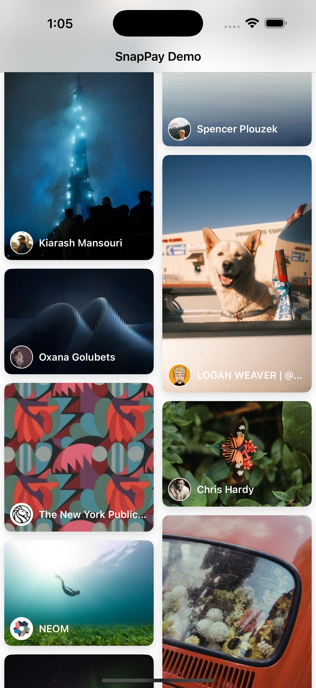

# 📷 Unsplash Gallery iOS App

An iOS photo gallery app built with UIKit, RxSwift, and Moya. It displays photos in a Pinterest-style **staggered layout**, supports pull-to-refresh and pagination, and includes a detail screen.

---

## ✨ Features

- 📸 Load photos from [Unsplash API](https://unsplash.com/developers)
- 🧱 Custom Staggered Layout (no 3rd party lib)
- 🔁 Infinite Scroll with RxSwift
- 📥 Pull-to-Refresh support
---

## 🛠 Architecture

- **UIKit + MVVM**
- **RxSwift / RxCocoa / RxRelay**
- **Moya** for API abstraction
---

## 📦 Dependencies

Using Swift Package Manager:

- [`RxSwift`](https://github.com/ReactiveX/RxSwift)
- [`RxCocoa`](https://github.com/ReactiveX/RxSwift)
- [`Moya`](https://github.com/Moya/Moya)
- [`Kingfisher`](https://github.com/onevcat/Kingfisher) *(optional: for image loading)*

> 🔥 No third-party UI layout libs used (staggered layout is fully custom).

---

## 🧪 RxSwift Highlights

- Data binding with `BehaviorRelay`
- `collectionView.rx.contentOffset` for infinite scroll
- Detail screen uses reactive data flow for UI updates

---
## 🚀 Getting Started
git clone https://github.com/naylinndev/UnsplashGallery.git
cd UnsplashGallery
open UnsplashGallery.xcodeproj
Install SPM packages (RxSwift, Moya)

Build and run!

## 📸 Screenshots

### Home Screen

